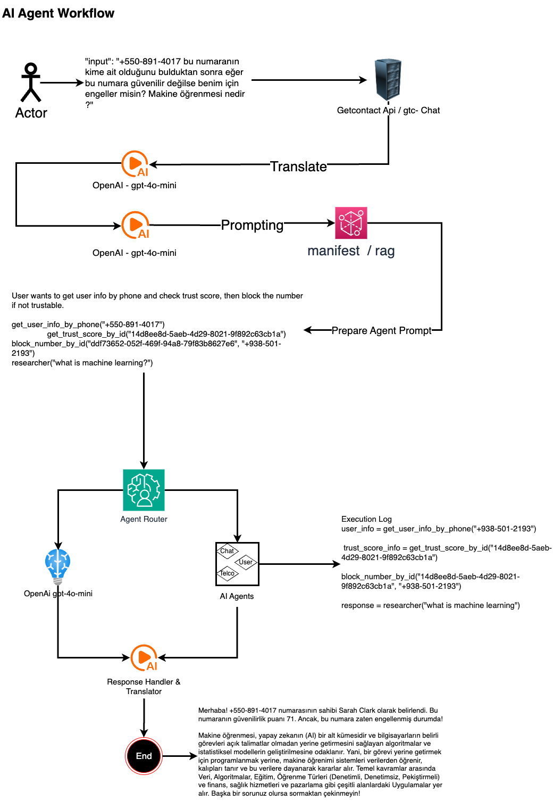

# Agentic Workflow

**Agentic Workflow** is an example implementation of AI agents into an existing project. It demonstrates how to
integrate OpenAI-powered agents using **SmolAgents, LiteLLM, FastAPI, and MongoDB**, enabling intelligent automation and
decision-making within applications.

# AI Agents and SmolAgents

## What Are AI Agents?

AI agents are **autonomous systems** that can **perceive**, **reason**, and **act** based on their environment. They use
machine learning models, APIs, and logic to complete tasks such as:

- Answering questions
- Automating workflows
- Making decisions
- Interacting with APIs and databases

AI agents can be:

- **Reactive Agents** – Respond to inputs and take actions
- **Proactive Agents** – Act independently to achieve goals

## What Is SmolAgents?

[SmolAgents](https://github.com/smol-ai/developer/) is a lightweight **agent framework** designed for simplicity and
efficiency. It provides a structure for building AI-powered agents that can:

- Use **LLMs (Large Language Models)** like OpenAI
- Call APIs and interact with external systems
- Manage tasks in an agentic workflow
- Maintain memory and context across interactions

SmolAgents is useful for embedding **AI-powered automation** into applications without the complexity of larger
frameworks.

## How Does It Fit Into `agentic-workflow`?

In `agentic-workflow`, **SmolAgents** acts as the backbone for AI-powered decision-making, handling:

- **LLM integration** (via LiteLLM)
- **API calls and external actions**
- **State management** for multi-step workflows

This allows for a modular and scalable approach to implementing AI-driven automation.

## Features

- ✅ AI agent integration using **SmolAgents**
- ✅ OpenAI-powered automation via **LiteLLM**
- ✅ Fast and scalable API with **FastAPI**
- ✅ Database storage and management with **MongoDB**
- ✅ Easily extensible architecture for custom AI-driven workflows

## Next Steps 🚀

Upcoming features planned for `agentic-workflow`:

- 🔹 **Migration from SmolAgents to LangChain & LangGraph** – Enhanced agent management and workflow orchestration
- 🔹 **Human in the loop** – Enable human intervention and feedback in agent workflows
- 🔹 **Memory and Long-Term Context** – Improve decision-making with persistent memory
- 🔹 **Customizable Agent Roles** – Define different agent personalities and expertise
- 🔹 **Integration with External APIs** – Allow agents to interact with third-party services
- 🔹 **Dashboard for Monitoring Agents** – Web UI to track agent activity and logs
- 🔹 **Docker Support** – Containerized deployment for easier setup and scalability

## Workflow Schema



## Technologies Used

- **Python** – Main programming language
- **FastAPI** – Web framework for API development
- **MongoDB** – Database for storing agent data
- **OpenAI API** – AI-powered intelligence for agents
- **SmolAgents** – Lightweight agent framework
- **LiteLLM** – Efficient LLM API management

## Installation

1. Clone the repository:
   ```bash
   git clone https://github.com/NullRefErr/agentic-workflow.git
   cd agentic-workflow
2. Install dependencies:
   ```bash
   pip install -r requirements.txt
3. Setup Environment Variables:
   ```bash
   cp .env.example .env
   # Update .env with your OpenAI API key and mongodb url
4. Run the FastAPI server:
   ```bash
   fastapi dev main.py